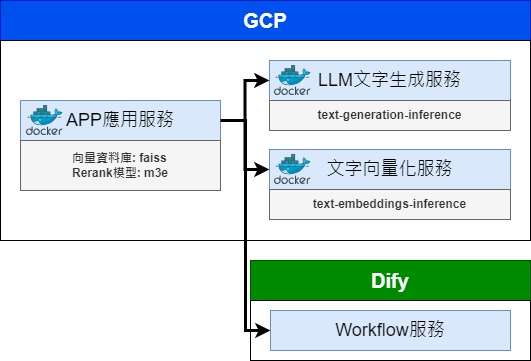
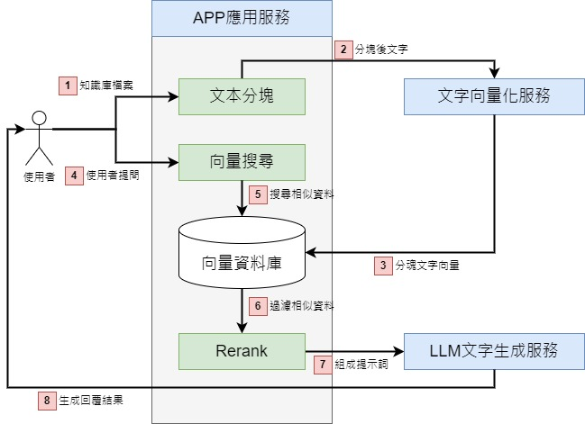
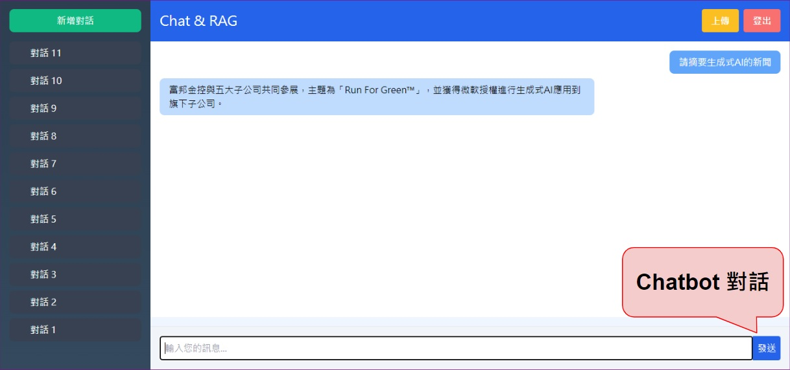
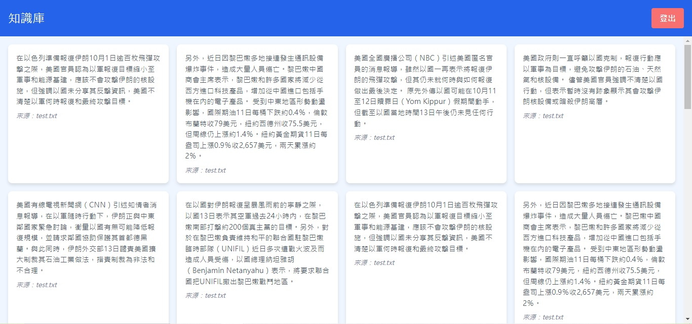
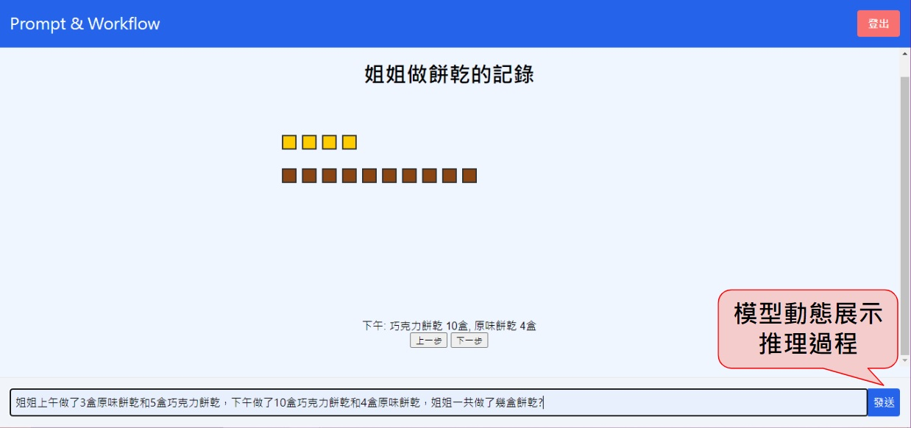

# Demo

## 一、佈署流程

1. 運行環境

   | 項目     | 規格             |
   | -------- | ---------------- |
   | 雲平台   | GCP              |
   | 機器類型 | c2-standard-4    |
   | 作業系統 | Ubuntu 20.04 LTS |
   | 磁碟大小 | 100 GB           |

2. 參考 <a href="https://docs.docker.com/engine/install/ubuntu/">docker 安裝步驟</a>安裝 docker 及 docker compose。
3. 下載本專案
   ```bash for Linux
   git clone https://github.com/hsiehpinghan/django_demo.git
   ```
4. 佈署系統

   ```bash for Linux
   cd django_demo
   sudo docker compose up -d
   ```

5. 測試網址: `http://localhost`

## 二、系統架構



系統架構說明：

- APP 應用服務：負責接收前端請求，並將請求轉發給後端服務。
- LLM 文字生成服務：接收提示詞的請求並生成回答。
- 文字向量化服務：接收文字的請求並回傳向量。
- Workflow 服務：接收請求並依預先設定的工作流完成任務。

## 三、資料流程



資料流程說明：

1. 使用者上傳知識庫文件，目前可接受 txt、pdf、docx 格式。
2. 將使用者上傳的文件分塊後提交「文字向量化服務」。
3. 將分塊文字的向量化結果存入向量資料庫。
4. 使用者提出問題。
5. 將使用者問題轉換為向量後搜尋向量資料庫中的相似分塊文字。
6. 將相似分塊文字使用 Rerank 模型再過濾一次。
7. 將過濾後的相似分塊文字與使用者的問題一起提交「LLM 文字生成服務」。
8. 「LLM 文字生成服務」生成回答後回傳給 APP 應用服務再回傳給使用者。

## 四、Demo 頁面

1. 對話頁面
   
2. 知識庫分塊文字頁面
   
3. 工作流頁面
   
